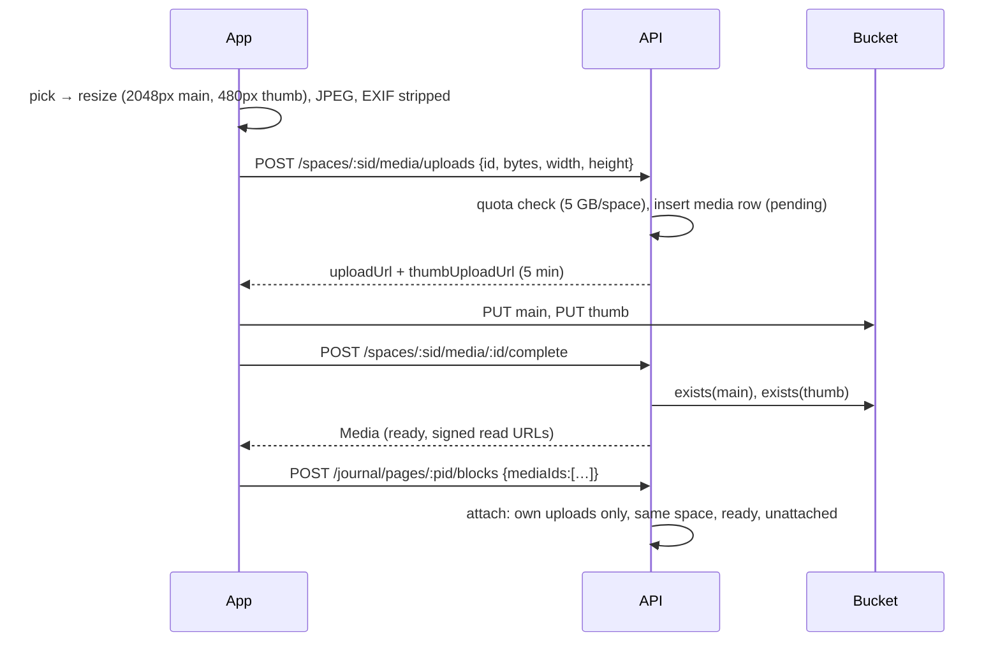

# 4. Storage & media

Photos (**Memories**) are the only binary data. They never pass through the API process: the phone uploads straight to object storage with a short-lived signed URL, and the API only records metadata and hands out signed read URLs.

## One interface, two drivers (`apps/api/src/lib/storage.ts`)

```ts
interface Storage {
  signedPutUrl(key, contentType, maxBytes): string; // upload, 5 minutes
  signedGetUrl(key): string;                        // read, ~1 hour
  exists(key): Promise<{ bytes } | null>;
  deletePrefix(prefix): Promise<void>;
}
```

| `STORAGE_DRIVER` | Where files live | URLs |
|---|---|---|
| `local` (dev, default) | `apps/api/.data/media/` on disk | `/v1/files/:token`, where the token is HMAC-signed with the auth secret and carries key, mode (put/get), expiry and max size ([ADR 0006](../adr/0006-every-external-service-has-a-local-stand-in.md)) |
| `s3` (production) | A private S3-compatible bucket (Cloudflare R2) | Presigned by Bun's built-in `S3Client` |

Read URLs expire on the **hour boundary**, not an hour after each request. So the same photo gets the same URL for up to an hour, and `expo-image`'s disk cache keeps working.

## Key layout

```
spaces/<spaceId>/media/<mediaId>/main.jpg
spaces/<spaceId>/media/<mediaId>/thumb.jpg
```

Everything a space owns sits under `spaces/<spaceId>/`, so purging a closed space is one `deletePrefix`.

## Upload flow



- **Privacy:** re-encoding on the device drops EXIF, including GPS. The server never sees originals.
- **Ownership:** you can only attach photos you uploaded to this space (`mediaRepo.ownUploads`), so a leaked media id is useless to anyone else.
- **Idempotent:** the media id is generated on the device. Retries reuse the same row and URLs.

## Cleanup

- `purgeStaleUploads` (hourly) removes uploads never completed within a day, or never attached within a week.
- Deleting an account removes that person's uploads from storage before their rows cascade (`removeUploadsBy`).
- Purging a closed space deletes `spaces/<id>/` and then the database rows.

## Export

`GET /spaces/:sid/export` returns JSON with signed photo links that expire after an hour. The app writes it to a file and opens the share sheet.
