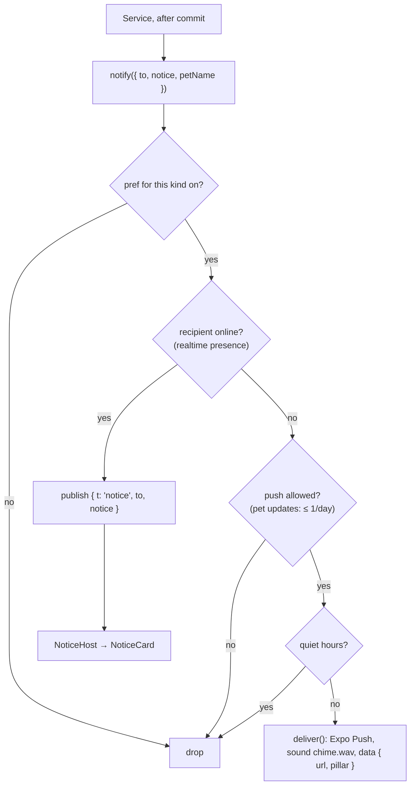

# 5. Notifications

A **Notice** is one piece of news for one Member: "a Note is waiting", "ready to reveal", "Mochi is all grown up". The same Notice reaches the Member in one of two ways, in the same words:

- **In the app right now:** a live in-app banner, the themed `NoticeCard`.
- **Away:** a push notification with the Love Notes chime.

## One source for the words

`noticeCopy(notice, petName)` in contracts returns `{ title, body, url, pillar, pref }`.

- The API uses it for push text, and the app uses it for the banner. They can't disagree, and there's no copy to translate twice.
- `pillar` picks the colour family (DESIGN §2.3): notes → pink, today → sky, know → purple, remember → butter, future → green, pet → orange.
- `pref` names the setting that switches this kind off.
- `url` is the deep link that tapping opens (`/notes/:id`, `/daily`, `/quiz/:id`, `/journal/:id`, `/future`, `/pet`).

| Notice | Sent when | To | Setting |
|---|---|---|---|
| `note.waiting` | A Note is created | the recipient | Notes |
| `vibe.shared` | A Vibe is shared | partner | Shared vibes |
| `quiz.started` | A pack is started | partner | Quizzes |
| `quiz.your_turn` | One member sends their answers | partner | Quizzes |
| `quiz.ready` | The second member sends theirs (the Reveal unlocks) | partner | Quizzes |
| `journal.written` / `journal.photos` | A Block is added (photos only → `journal.photos`) | partner | Journal & photos |
| `future.done` | A Future item is stamped done | partner | Our future |
| `pet.milestone` | The Pet earns a Milestone | both | Pet updates (opt-in) |

## Pet updates

Milestones are written in the Pet's voice (`MILESTONE_COPY`, e.g. "Mochi is starting to feel at home with you two"). The rules keep them delightful, not naggy:

- **Opt-in.** `petUpdates` defaults to off.
- **Good news only.** There is no "Mochi is hungry": Well-being never drops below calm, so there's nothing to warn about ([ADR 0003](../adr/0003-derived-pet-mood-and-soft-wellbeing.md)).
- **At most one push a day.** `pets.last_update_push_at` rate-limits pushes (20 hours). Within that window, milestones still appear in the app and in the Pet timeline.
- If one action earns several milestones, only the latest is announced. All of them are in the timeline.

## Preferences and quiet hours

`notification_prefs` stores one row per user, created on first change. Defaults: everything on except Pet updates; no quiet hours. Quiet hours can wrap past midnight (22:00–08:00) and are evaluated in the **recipient's** timezone. Nothing is queued for later: a push skipped for quiet hours simply isn't sent, and the in-app state is waiting when they open the app.

## Delivery

`push-transport.ts`:

- **`PUSH_TRANSPORT=console`** (dev and tests) logs the push and keeps the last 100 in `pushOutbox`, so tests can assert on them.
- **`PUSH_TRANSPORT=expo`** posts to the Expo Push Service with `sound: "chime.wav"` and `data: { url, pillar }`.

Device tokens are registered by the app after permission is granted (`PUT /me/push-tokens/:token`) and removed on sign-out. `notify` never throws: a failed push is logged and the action that caused it still succeeds.

## In the app

- **`NoticeHost`** (`features/notices`) is mounted once for signed-in users. It listens for realtime `notice` events addressed to me, and for pushes that land while the app is in the foreground (`onForegroundPush`). The system banner is suppressed in the foreground, so every Notice looks like ours.
- Notices queue (at most three) and show one at a time for 5 seconds. Swipe up to dismiss; tap to open its link. A light haptic plays on arrival. Screen readers get an alert with "Dismiss" and "Open" actions.
- If you're already on the screen a Notice points to, it's skipped: that screen is updating live anyway.
- **`NoticeCard`** (design system): a paper slip with pillar-coloured tape, the Pet in a pillar-soft badge, the pillar label, title and body (DESIGN §7.4).
- **Tapping a push** that arrived while the app was closed routes through `useNotificationRouting`, which uses the same `url`.

## The chime

`apps/mobile/assets/sounds/chime.wav` is generated by `scripts/make-chime.ts`: two soft bell tones (E6 → B6) with a quick decay, about 0.9 seconds long. It's registered through the `expo-notifications` config plugin (`sounds`) and bundled into the native app, so changing it needs a native rebuild.
