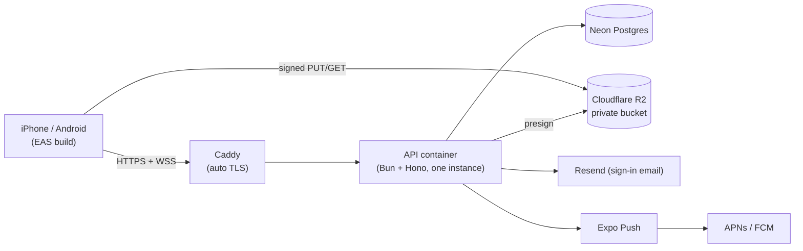

# 9. Deployment

The step-by-step runbook is [docs/DEPLOY.md](../DEPLOY.md). This page explains the shape of production and why it's that way.

## Topology ($0/month infrastructure)

- **One API instance** on an always-free ARM VM (Oracle), behind Caddy, which handles TLS for the API and the WebSocket. `deploy/docker-compose.yml` + `deploy/Caddyfile`; the image is built from `apps/api/Dockerfile`.
- **Postgres on Neon.** Migrations run on every container start (`db:migrate`), and quiz content syncs from the repo on boot.
- **Photos in R2.** The bucket is private and all access uses presigned URLs. R2 has no egress fees, which suits a photo-heavy app.
- **Email via Resend** for OTP codes. **Push via Expo** (an APNs key uploaded to EAS).

## Configuration

`deploy/.env.production.example` lists everything. The important production values:

| Variable | Production value |
|---|---|
| `NODE_ENV` | `production` (enables the refusal of dev flags) |
| `EMAIL_TRANSPORT` | `resend` + `RESEND_API_KEY` |
| `PUSH_TRANSPORT` | `expo` |
| `STORAGE_DRIVER` | `s3` + `S3_ENDPOINT`, `S3_BUCKET`, keys |
| `DEV_TOOLS`, `DEV_FIXED_OTP` | **unset** (startup fails otherwise) |

The app's API URL comes from `EXPO_PUBLIC_API_URL` at build time.

## Why a single instance is fine (for now)

Realtime presence and pub/sub are in-process. With two people per space and a small beta, one Bun process handles far more sockets than needed. Scaling out means swapping `realtime/hub.ts` for Postgres `LISTEN/NOTIFY` (or Durable Objects), which is the only file that knows how events travel. The hourly cleanup is idempotent, so it's safe to run on every instance.

## Release checklist

1. `bun run lint && bun run typecheck && bun run test` green on `main`.
2. Review any new migration SQL.
3. `docker compose up -d --build` on the VM; check `/health`.
4. For app changes: `eas build` → TestFlight. For JS-only changes an EAS Update is enough; native changes (new modules, the chime) need a new build.
