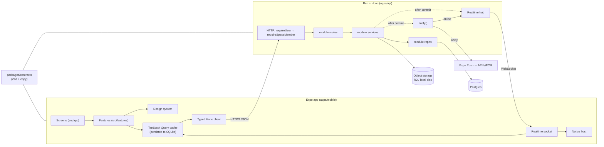

# Architecture

Love Notes is a **modular monolith**: one Expo app, one Bun API, one Postgres, and a shared contracts package that both sides compile against. This folder explains it one layer at a time, from the outside in. Words in **bold capitals** (Space, Pet, Notice…) are defined in [CONTEXT.md](../../CONTEXT.md); the reasons behind the bigger choices are in [docs/adr](../adr).

| # | Layer | What it owns |
|---|---|---|
| 1 | [Contracts](01-contracts.md) | Every request/response shape, realtime event, limit and piece of shared copy |
| 2 | [API](02-api.md) | HTTP, auth, the membership gate, modules (routes → service → repo), realtime, jobs |
| 3 | [Database](03-database.md) | Tables, ownership per module, migrations, deletion and retention |
| 4 | [Storage & media](04-storage-and-media.md) | Photo uploads, signed URLs, quotas, cleanup |
| 5 | [Notifications](05-notifications.md) | Notices: live in-app banners and pushes, preferences, quiet hours, the chime |
| 6 | [The pet](06-pet.md) | Bond, mood, Well-being, growth, Milestones, the Pet timeline |
| 7 | [Mobile](07-mobile.md) | Routing and flow guards, data/caching, realtime, features, design system |
| 8 | [Local dev & testing](08-dev-and-testing.md) | Local stand-ins, the simulated partner, the test suites and lints |
| 9 | [Deployment](09-deployment.md) | Production topology and the path to it |
| 10 | [Widgets](10-widgets.md) | Home-screen widgets on iOS and Android: one snapshot, two native renderers |

## The shape of the system

## One request, end to end

Anna leaves Ben a Note:

1. **Mobile.** The *new note* screen calls `useCreateNote`, which generates the note id on the device ([ADR 0008](../adr/0008-client-generated-ids.md)) and posts through the typed client. The Wall shows it at once, optimistically.
2. **HTTP.** `requireUser` resolves the session, and `requireSpaceMember` checks that Anna belongs to `:sid`. It then puts a `SpaceScope` on the context; a stranger gets 404, never 403 ([ADR 0002](../adr/0002-space-scope-is-the-authorization-boundary.md)). The route validates the body against the contract.
3. **Service.** `createNote` runs one transaction. `notesRepo.insert` stores the note, `growPet(tx, scope, "note.created")` adds Bond and records any Milestones, and the member directory supplies Anna's name. The transaction returns *what happened*, never a side effect.
4. **After commit.** The service publishes `note.created` on the space's realtime topic, announces the Pet outcome, and calls `notifyPartner` with a `note.waiting` Notice.
5. **Ben's phone.** If Ben is in the app, the socket delivers a `notice` event and the Notice host shows the pink Notes banner, with the Pet peeking out. If he's away, he gets a push with the same words and the Love Notes chime. Either way `noticeCopy` wrote the text, so the two can't drift.

## Rules that hold everywhere

- **Contracts are the only shared language.** The API validates input with them and the app types everything with them. There are no hand-written DTOs on either side.
- **Every space query takes a `SpaceScope`.** Only the membership gate can make one. Repos never accept a bare `spaceId` from a request.
- **Only repositories touch tables**, and a module talks to another only through its `index.ts`. Enforced by `scripts/check-architecture.ts`.
- **Side effects happen after commit.** Realtime events, Notices and pushes never describe rolled-back work.
- **Private means no read path.** A private Vibe isn't filtered in the UI; the API has no query that returns it to the partner ([ADR 0004](../adr/0004-private-vibes-have-no-read-path.md)).
- **Design tokens only.** No hex, font sizes or off-scale spacing outside `design-system/`. Enforced by `scripts/check-design-tokens.ts`.
